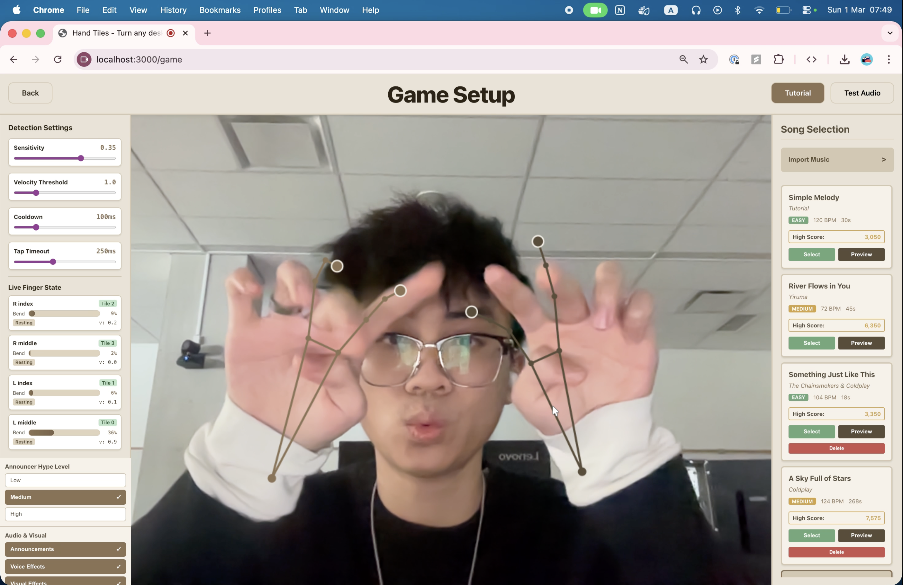
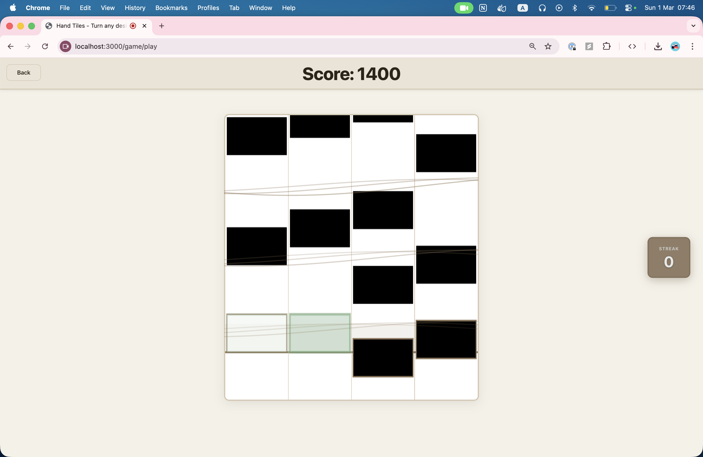

# 🎹 Hands Tiles

> Turn your hands into a rhythm game controller

Hands Tiles is a browser-based Piano Tiles-style rhythm game where falling tiles are hit by tapping **any flat surface** with your fingers. Uses webcam + MediaPipe Hands for real-time hand tracking and computer vision-based tap detection.




## Features

### 🎮 Core Gameplay
- **Hand-Controlled Rhythm Game** - Piano Tiles gameplay using just your hands and a webcam
- **4-Lane System** - Tiles fall across 4 lanes mapped to your play area
- **Scoring** - Perfect (100pts), Good (50pts), Miss (0pts) based on timing
- **Combo System** - Build streaks with milestones at 5, 10, 15, 20, 25+ combos
- **Lives System** - 3 lives with penalty for missed tiles

### 👁️ Computer Vision & Hand Tracking
- **MediaPipe Hands** - Real-time tracking of 21 hand landmarks
- **Multi-Finger Support** - Simultaneous tracking of all 5 fingertips
- **Velocity-Based Tap Detection** - State machine algorithm (idle → moving_down → tapped → lifting)
- **Position Smoothing** - EMA filter with rolling window velocity tracking
- **Cooldown System** - 150ms per-finger cooldown prevents double-taps

### 📐 Play Area Calibration
- **Homography Mapping** - 4-corner calibration transforms camera to play area coordinates
- **Interactive Setup** - Visual click-to-mark interface with real-time feedback
- **Test Mode** - Verify lane mapping before saving
- **Persistent Storage** - Calibration saved across sessions in localStorage

### 🎵 Advanced Audio System
- **Web Audio API** - Zero-latency programmatic sound generation
- **3D Spatial Audio** - Panner nodes position sounds in 3D space per lane
- **Reverb & Echo** - Convolver with dry/wet mix (60/40) and 150ms delay
- **Dynamic Compression** - Prevents clipping and normalizes volume
- **Lane-Specific Notes** - Musical notes (C4, E4, G4, B4) mapped to lanes
- **Hit Quality Feedback** - Different tones for perfect/good/miss

### 🎤 Voice & Sound Effects
- **Voice Announcements** - Combo celebrations ("5 STREAK!", "ON FIRE!")
- **Celebration Sounds** - Random effects (awesome, perfect, boom, yeah, on-fire)
- **Impact Sounds** - Audio feedback on successful hits
- **Game Start Announcement** - "LET'S GO!" with customizable intensity
- **3-Tier Hype System** - Low/Medium/High intensity levels

### 🎹 Music Import System
- **MIDI Import** - Parse MIDI files to generate beatmaps
- **Sheet Music OCR** - Optical Music Recognition for sheet music images
- **MP3 Background Music** - Upload audio with auto-normalization (up to 5x boost)
- **Random Note Generation** - Create playable beatmaps from MP3-only imports
- **Polyphony Handling** - 4 extraction strategies (melody-line, highest-note, smart-lanes, round-robin)
- **Note Spacing Control** - Minimum 400ms spacing, manual BPM override
- **Duplicate Prevention** - Rejects imports with existing song names

### 🎼 Background Music Player
- **MP3/WAV Playback** - Pre-rendered audio file support
- **Auto-Normalization** - Analyzes peak volume and boosts quiet audio
- **Synchronized Playback** - Perfect timing with game loop
- **Volume Balancing** - Background at 20%, player notes louder
- **MIDI-to-Audio** - Server-side conversion using FluidSynth

### ✨ Visual Effects
- **Screen Shake** - Subtle shake on perfect hits (200ms)
- **White Flash** - Full-screen flash for perfect notes
- **Hit Highlights** - Green flash effects on successful hits
- **Audio Wave Visualization** - Animated sine waves on note hits
- **Column Glow** - White sparkle rising up lane columns
- **Flash Tiles** - White feedback on tap (300ms fade)
- **Text Announcements** - Dynamic overlays with elastic scaling and random positioning

### 📚 Interactive Tutorial
- **Voice-Narrated Guide** - Step-by-step walkthrough with AI narration
- **8 Tutorial Steps** - Covers all features from settings to gameplay
- **Visual Highlighting** - Tooltips with element highlighting
- **Progress Tracking** - Tracks completed steps
- **Navigation Controls** - Forward/backward through steps

### ⚙️ Settings & Customization
- **Detection Tuning** - Adjustable sensitivity, velocity threshold, cooldown
- **Real-Time Feedback** - Live finger state display
- **Hype Level Control** - Low/Medium/High announcer enthusiasm
- **Toggle Switches** - Voice announcements, voice effects, visual effects, screen shake
- **3D Audio Test** - 360° spatial audio preview

### 🎯 Song Management
- **Song Browser** - Scrollable list with metadata display
- **Song Preview** - 10-second melody preview
- **High Score Display** - Personal best for each song
- **Difficulty Colors** - Visual coding (Easy=green, Medium=yellow, Hard=red)
- **Delete Function** - Remove imported songs (built-in protected)
- **Persistent Storage** - Songs saved to localStorage and API

### 🏆 Scoring & Progression
- **High Score Tracking** - Per-song personal bests with accuracy
- **Accuracy Calculation** - (hits / total notes) × 100%
- **Score Persistence** - localStorage-based storage
- **New Record Detection** - Alerts on beating previous best
- **Stats Display** - Final score, accuracy, high score comparison

### 🔧 Technical Features
- **Monorepo Architecture** - Apps, Services, Shared types
- **TypeScript** - Full type safety across stack
- **React + Vite** - Modern frontend with fast HMR
- **Express API** - Backend for song storage
- **SQLite Database** - Score persistence infrastructure
- **Decoupled Loops** - 30fps vision, 60fps render
- **Performance Optimized** - Smoothing filters, efficient canvas rendering

## Tech Stack

| Layer | Technology |
|-------|------------|
| Frontend | React + TypeScript + Vite |
| Backend | Node.js + Express + TypeScript |
| Hand Tracking | MediaPipe Hands |
| Audio | Web Audio API |
| Database | SQLite (better-sqlite3) |
| Computer Vision | Custom homography implementation |

## Project Structure

```
tabletiles/
├── apps/
│   └── web/                 # React frontend
│       ├── src/
│       │   ├── game/        # Game engine & canvas
│       │   ├── vision/      # Hand tracking & calibration
│       │   ├── api/         # API client
│       │   └── types/       # TypeScript types
│       └── vite.config.ts
├── services/
│   └── api/                 # Express backend
│       ├── src/
│       │   ├── routes/      # API routes
│       │   └── db/          # SQLite database
│       └── tsconfig.json
└── shared/
    └── types/               # Shared types
```

## Setup

### Prerequisites

- Node.js 18+ (or use `nvm` to install)
- npm or pnpm

### Installation

```bash
# Install dependencies
npm install

# Start both frontend and backend
npm run dev
```

This will start:
- Frontend dev server: http://localhost:3000
- Backend API server: http://localhost:3001

### Camera Permissions

When you first load the app, your browser will request camera access. This is required for hand tracking. Make sure to **allow** camera permissions.

## How to Play

### 1. Calibrate Your Play Area

On first launch, click **"Calibrate Play Area"**:

1. Click the **4 corners** of your play area in order:
   - Top-left → Top-right → Bottom-right → Bottom-left
2. The system will compute a homography matrix to map camera pixels to play area coordinates
3. **Test mode**: Click anywhere in the play area to verify the lane mapping
4. Click **"Save & Continue"** when satisfied

Calibration is saved to localStorage and persists between sessions.

### 2. Start Playing

1. Click **"Start Game"**
2. Tiles will fall in 4 lanes
3. **Tap any flat surface** where a tile crosses the green hit line
4. Score increases based on timing:
   - **Perfect**: ±30px from hit line (100 points)
   - **Good**: ±60px from hit line (50 points)
   - **Miss**: everything else (0 points)
5. Build combos for multipliers!
6. You have **3 lives** - lose one for each missed tile

### 3. Debug Mode

During gameplay, click **"Show Debug"** to see:
- All 21 hand landmarks color-coded
- Bone connections between joints
- Fingertip labels
- Real-time hand detection

## Tap Detection Algorithm

The system uses a velocity-based state machine:

```
IDLE → MOVING_DOWN → TAPPED → LIFTING → IDLE
```

**Tap trigger conditions:**
1. Fingertip Y-velocity > threshold (moving downward)
2. Fingertip is within calibrated play area bounds
3. Not in cooldown period (prevents double-taps)

**Smoothing:**
- Exponential Moving Average (EMA) filter for position
- Rolling window velocity tracker (last 5 frames)
- 150ms cooldown per finger

## API Endpoints

### `GET /health`
Health check

### `GET /leaderboard?limit=10&songId=default`
Get top scores

**Response:**
```json
{
  "songId": "default",
  "entries": [
    {
      "id": "uuid",
      "name": "Player",
      "score": 12345,
      "accuracy": 0.95,
      "createdAt": "2024-01-01T00:00:00.000Z"
    }
  ]
}
```

### `POST /score`
Submit a score

**Body:**
```json
{
  "songId": "default",
  "name": "Player",
  "score": 12345,
  "accuracy": 0.95,
  "meta": { "device": "web" }
}
```

## Troubleshooting

### Camera not working
- Ensure camera permissions are granted in your browser
- Check that no other app is using the camera
- Try a different browser (Chrome/Edge recommended)

### Hands not detected
- Make sure you have good lighting
- Keep hands in frame with palms visible
- Avoid cluttered backgrounds
- Try adjusting camera angle

### Taps not registering
- Re-calibrate the play area
- Ensure you're tapping within the calibrated zone
- Try tapping more deliberately (faster downward motion)
- Check that your surface is flat and stable

### Audio not playing
- Click anywhere on the page to initialize audio context
- Check browser volume settings
- Ensure Web Audio API is supported (modern browsers)

### Performance issues
- Close other browser tabs
- Use a modern browser (Chrome/Edge recommended)
- Reduce video quality in camera settings
- Disable debug mode during gameplay

## Development

### Run frontend only
```bash
npm run dev:web
```

### Run backend only
```bash
npm run dev:api
```

### Build for production
```bash
npm run build
```

### Project Commands
```bash
npm run dev          # Start both frontend and backend
npm run build        # Build both projects
npm run build:web    # Build frontend only
npm run build:api    # Build backend only
```

## Architecture Notes

### Coordinate Spaces

1. **Video Pixels**: Raw MediaPipe landmark coordinates (normalized 0-1)
2. **Play Area UV**: Homography-transformed coordinates on play area plane (0-1)
3. **Game Space**: Canvas pixel coordinates for rendering

### Performance

- Hand tracking runs at 30fps (capped for performance)
- Game rendering runs at 60fps
- Vision loop is decoupled from render loop
- No server round-trips in the critical path

### Audio System

All sounds are generated using Web Audio API:
- 4 lanes mapped to notes: C4, E4, G4, B4
- ADSR envelope for each note
- Different waveforms for hit quality (perfect/good/miss)
- Combo milestone sounds (ascending arpeggio)

## Future Enhancements

- [ ] Two-hand support + multi-lane chords
- [ ] Beatmap editor (record taps → export JSON)
- [ ] Auto surface detection using OpenCV edge detection
- [ ] Replay mode (store taps + tile spawns)
- [ ] WebSocket live spectators scoreboard
- [ ] Multiple difficulty levels
- [ ] Custom beatmap import

## Credits

Built with:
- [MediaPipe Hands](https://google.github.io/mediapipe/solutions/hands.html)
- [React](https://react.dev/)
- [Vite](https://vitejs.dev/)
- [Express](https://expressjs.com/)

## License

MIT

---

**Tagline:** "Turn your hands into a rhythm game controller." 🎹✨
